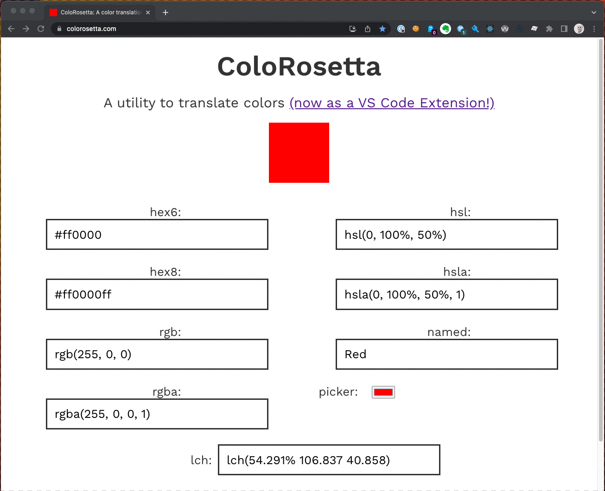

One of my favorite details of the ColoRosetta tool that I have built is the color changing favicon. It updates as you adjust the color in real time!



And if you are using the tool in Safari, the overall color scheme of the browser will also update in real time, via the `theme-color` meta tag.


In this blog post I want to share the function that does this and explain how it works.

First, some context - ColoRosetta is a small React app. When a user changes a color input, first that change is validated, then the color is passed to the root `App` component. Within that component we determine _what kind_ of color it is, and pass both pieces of information to the `colorFavicon` function. That lives in it's own file:

```javascript
import { translatedColor } from '../utils/translatedColor';

// the arguments incomingColor and incomingColor type are specific to ColoRosetta
// you don't necessarily need to have them
const colorFavicon = (incomingColor, incomingColorType) => {
    const img = new Image();
    const canvas = document.createElement('canvas');
    canvas.width = 32;
    canvas.height = 32;
    const ctx = canvas.getContext('2d');
    const link = document.querySelector("link[rel*='icon']") || document.createElement('link');
    link.type = 'image/x-icon';
    link.rel = 'shortcut icon';
    document.getElementsByTagName('head')[0].appendChild(link);
    // translatedColor is partiuclar to ColoRosetta - this can be whatever you want
    const color = translatedColor(incomingColor, incomingColorType, 'hex6');
    img.src = '';
    ctx.drawImage(img, 0, 0);
    ctx.fillStyle = color;
    ctx.fillRect(0, 0, 32, 32);
    link.href = canvas.toDataURL("image/x-icon");

    const meta = document.querySelector("meta[name='theme-color']") || document.createElement('meta');
    meta.name = "theme-color";
    document.getElementsByTagName('head')[0].appendChild(meta);
    meta.content = color;
}
```

## The Favicon

The approach here is that we're going to make a new image & canvas on every color change, encode it as a string, and update the icon `link` element.

Full disclosure - I got a lot of this functionality from [this Stack Overflow answer](https://stackoverflow.com/questions/6964144/dynamically-generated-favicon). What I've added here is the fact that it's updated dynamically by react.

### Particularities of ColoRosetta

The arguments `incomingColor` and `incomingColorType` are particular to ColoRosetta. I need to know what the user's input actually _is_, and what kind of color that input is, which is determined by the point that they change a color elsewhere. I need those two pieces of information later to pass to my `translatedColor` function which transforms the color to a hex6 value.

These three pieces can be whatever _you_ want - this was just how my app works.

### Making an Image and Canvas

```javascript
    const img = new Image();
    const canvas = document.createElement('canvas');
    canvas.width = 32;
    canvas.height = 32;
    const ctx = canvas.getContext('2d');
```

Here we make a new image, with, well, `new Image()`. We also make a 32 x 32 pixel `canvas`, and address it's 2d context (`ctx`). More on that in a minute.

### Making the Link element

```javascript
    const link = document.querySelector("link[rel*='icon']") || document.createElement('link');
    link.type = 'image/x-icon';
    link.rel = 'shortcut icon';
    document.getElementsByTagName('head')[0].appendChild(link);
```

Here we look for a `link` element with a `rel` attribute that includes `icon` - or we fall back to creating one. It's a bit belt-and-suspenders to have the fallback in my case, as I have control over the source HTML, but it's a good idea.

Once we have that `link`, we make sure it's `type` is `image/x-icon` and it's `rel` is `shortcut icon`. This is what tells the browser that this is a favicon.

We then append this `link` element to the `head`. Note - if we found a link element to begin with, this does not add more and more link elements - it replaces it.

### Making sure the color is hex6

```javascript
    const color = translatedColor(incomingColor, incomingColorType, 'hex6');
```

This is particular to ColoRosetta - `incomingColor` is the color coming from state in my application. The color that is set by the user can be one of many types. This function takes their input and ensures that it's translated to hex6 (e.g. #121212). We need a hex6 color in order for the color to work with the `fillStyle` attribute below.

### Drawing the icon in Canvas

```javascript
    img.src = '';
    ctx.drawImage(img, 0, 0);
    ctx.fillStyle = color;
    ctx.fillRect(0, 0, 32, 32);
```

Remember `img`? that was the `new Image()` that we made earlier. We'll need that for our canvas context.

We then get that context, `ctx` and `drawImage` using the empty `img` that we made.

Here is where we actually _draw_ the favicon - we set `fillStyle` to our hex6 color, and make it a rectangle `32, 32` in size (which is also our `canvas` height and width).

### Encoding the resulting Canvas

We now have a canvas with a 32 x 32 pixel image that's filled with the color that we want.

```javascript
    link.href = canvas.toDataURL("image/x-icon");
```

We now encode it as a string with the `toDataURL` method, and set that string as the `href` for the `link` element that we're replacing/appending to the `head`.

The `toDataURL` method takes a image type argument - it defaults to `image/png`. We don't want that in the case of a favicon (though that is changing). We can set it to `image/x-icon` and we'll get an encoded image that a browser can handle as an icon.

Because this string gets updated every time that the application state changes, the browser will update the icon as it's getting displayed.

## Meta Theme Color

I was pretty happy with the above function, but shortly after I added it, Safari added a new meta tag - `theme-color` which will cause the browser chrome to update it's color.

```javascript
    const meta = document.querySelector("meta[name='theme-color']") || document.createElement('meta');
    meta.name = "theme-color";
    document.getElementsByTagName('head')[0].appendChild(meta);
    meta.content = color;
```

Here I'm largely following the same pattern as I did for the favicon. I look for a `meta` tag, make sure it's named `theme-color`. We simply replace the tag's `content` with `color` which we translated to hex6 earlier.

## Conclusion

I hope this line-by-line explanation of how to make a dynamic favicon is helpful. Frankly, having to write out each piece of this made me understand it at a much deeper level. At the very least I hope it gives you ideas on how you can make elements of your applications more dynamic.
