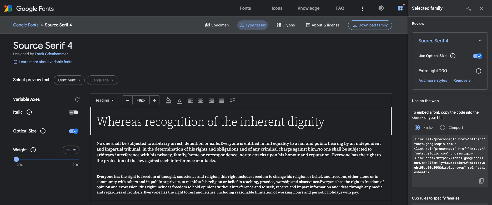
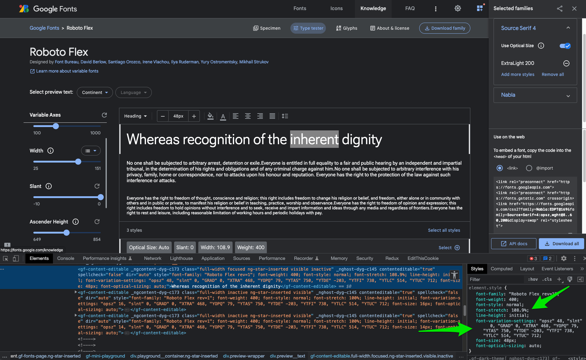

I'm a huge fan of variable fonts - I love the idea that you have so many design options while downloading one asset. I've also used Google Fonts since it launched.

Google Fonts has added a lot of awesome variable fonts to it's service in the last few years. They all have various features that are there for the using - if you know how.

Unfortunately the Google Fonts interface currently does little to show you _how to make use of a variable font_ once you've added it to your site. I'm hoping to fill in the gaps with this blog post.

## Finding Variable Fonts

You can check out [Google Fonts and filter to "Show only variable fonts"](https://fonts.google.com/?vfonly=true) and browse what is available. As of this writing, there are 288 available.

## Adding a Variable Font to your site

After you select a font (and hit the "+" sign next to a particular weight) you will see a font family added to the sidebar.



This is a standard snippet that Google recommends. You'll want to add this (or the equivelant for the font you want) and add it to the `head` of your page/site. This particular snippet is the one that I use on this very site at the time of this writing (note: I removed opitical sizing).

```html
  <link rel="preconnect" href="https://fonts.googleapis.com">
  <link rel="preconnect" href="https://fonts.gstatic.com" crossorigin>
  <link href="https://fonts.googleapis.com/css2?family=Source+Serif+4:wght@200..900&display=swap" rel="stylesheet">
```

The two `preconnect` tags are for domains that are necessary for adding a Google Font - this is a performance enhancement. I suspect the font would load without them, but it'd be slower, and who wants that?

The last tag is the actual call to the Google Fonts API in the form of a `stylesheet`. The `display=swap` query parameter tells Google Fonts to use `font-display: swap` on the typeface in question, which is another performance enhancement.

## Variable Font features API

The middle bit is the most important here:

```html
?family=Source+Serif+4:wght@200..900
```

This is specifying the typeface (in this case Source Serif 4) and the features I want to use. Here I'm using `wght` (weight), and a _range_ of weights from `200` to `900`.

The `..` is what indicates that I want to use _any weight between those two extremes_.

If I knew I _only_ wanted to use 200 and 900, I could use a comma instead:

```html
?family=Source+Serif+4:wght@200,900
```

The range, `..` is the magic of variable fonts. I'm making one request, I will get one asset, and now be able to use any weight between 200 and 900 in my design.

The Google Fonts UI doesn't make it super clear how to get a _range_ - rather it encourages specifying a list of specific weights. Their API documentation covers the `..` range indicator.

## Forming URL’s

The [full URL spec is outlined here](https://developers.google.com/fonts/docs/css2#forming_api_urls). It boils down to something like this:

```html
?family=<Family Name>:<axis_a>,<axis_b>@<axis_a_range>,<axis_b_range>
```

It can get really complicated, and I can't cover all of the use cases here. You can play with the 'type tester' UI and see the effect on the URL in the sidebar.

### What about performance?

As with everything, you will need to measure performance impact yourself. This will largely depend on which variable font features you use.

When I've measured my uses of a variable font in which I was using a range of weights, I have noticed a larger file size than if I had specified only certain weights. But, once I did specify a range, it really didn't matter how big of a range it was. `200..400` had the same impact as `200..900`.

## Making use of Variable Font features

Awesome - you now have a variable font added to your site. Now, how can you make use of it? It depends on which feature you're using. Some are more straightforward than others.

### Font Weight

Font weight is the most intuitive - you specify a `font-weight` in your CSS. What is cool now is that you can specify any number in your range:

```css
/* 200..900 */
font-weight: 200;
font-weight: 300;
font-weight: 451;
font-weight: 672;
font-weight: 900;
font-weight: 950; /* will fall back to 900 */
```

(Just don't get out of hand with it, mkay?)

### Font Style (i.e. italics)

If you are configuring a font with italics, and it's just a binary italic/normal style, then your CSS is again very simple:

```css
font-style: italic;
```

However, if you are using a font that offers a _slant_ instead, [such as Roboto Flex](https://fonts.google.com/specimen/Roboto+Flex/tester?vfonly=true), to make use of that you will need to follow the advice below.

### Other font features

This is where I find the Google documentation most lacking. There are so many cool features of variable fonts, but it is not clear _at all_ how to actually use them. You have to do some digging to figure it out.

The easiest thing to do is to use dev tools and inspect the Google Fonts typetester UI and see what CSS is being applied in order to make use of other features. Change settings in the UI, and see what changes in the applied CSS.



The above example is [Roboto Flex](https://fonts.google.com/specimen/Roboto+Flex/tester?vfonly=true), where the width and ascender height variables are tweaked.

For instance, if you want to take advantage of the width axis, you need to use:

```css
font-stretch: 108.9%;
```

Whereas if you want to adjust the ascender height, you need to use

```css
font-variation-settings: "YTAS" 739;
```

`font-variation-settings` is the CSS property that gives you control over variable font axis settings. You can read more [about font variation settings at MDN](https://developer.mozilla.org/en-US/docs/Web/CSS/font-variation-settings).

## Conclusion

I hope this helps you take full advantage of variable fonts which are available at Google Fonts. There is a lot to play with - go have fun!