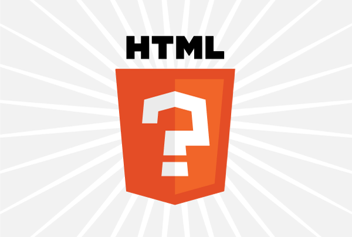

The Web Hypertext Application Technology Working Group, (WHATWG for short, 'cause it's catchy), the steering group who got the whole HTML5 party started, [decided to drop the 5 designation from their HTML5 specification][1]. They are deciding to make HTML a "[living standard][2]" that is continuously evolving.

This is a drastically different approach to the spec, as they are abandoning the "snapshot" approach of having set version numbers. As features get added to the spec, it will grow. It will be up to the browser manufacturers to support new features in the spec. Much more to the point, the spec will grow to adopt features browsers implement _first_.

There are some cries that this is a foolhardy approach, that now browser manufacturers won't have anything to work towards when making their software. How will they know what version of the HTML spec that they'll be compliant with?

They won't. And that's okay.

I think that the WHATWG's new approach is a brilliant change in policy that simply reflects reality. As web developers, the new approach means that we will have to figure out what parts of the spec that we want to use, and then see what is supported in our target browsers.

Which, if you're anything like me, is _how you work anyway_.

If we let go of the idea of fixed spec versions, we can stop moaning about how we cant use HTML5 until 2022 when the spec is final. We can focus on the reality that some things are useful today, and more is on the way.

There is also the purist cry that if the spec is a living thing, it will be subject to the whims of browser manufacturers and the features they see fit to introduce.

Well, I hate to break it to you, but it's been like that for a long, long time already. Who do you think is invited to the table in the W3 working groups?

Validation is another concern - how will we be able to validate against a moving spec? What doctype could we use? HTML5's doctype kind of removes that concern -

```html
<!DOCTYPE html>
```

Did you notice? No version number. All hail HTML.

[1]: https://blog.whatwg.org/html-is-the-new-html5
[2]: https://wiki.whatwg.org/wiki/FAQ#What_does_.22Living_Standard.22_mean.3F
