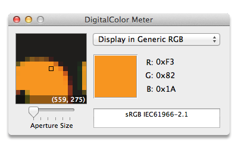

Have you ever wanted to figure out the particular color of a piece of text, or a background, without having to sift through a CSS file, or open Photoshop to use its eye dropper tool?

One of the secrets of the Mac OS, at least for web designers, is the utility called Digital Color Meter. I'm surprised more designers and developers don't know about it, so I thought I'd try to rectify that situation.
<!--more-->

<h3>What does it do?</h3>
Simply put, it measures the color of a particular pixel on your screen. It will change its reading as you move your cursor over the screen - it measures the pixel at the tip of your cursor.

To use Digital Color Meter, go to <strong>Applications/Utilities</strong>, and you'll find it there (along with other goodies like Network Utility). When open, it will present a floating window with a magnified representation of where your cursor point is.

You will also see a set of RGB values of the color of that pixel. But what if you don't want RGB values?

<h3>How to set it up for a web design workflow</h3>
For a lot of web design, you're going to want to have hex values of colors. The way digital color meter used to work, you could select "hex" from the drop down in the floating window, and get just that.

In Lion, though, Apple changed where this toggle is.  <strong>Go to the View menu, Display Values > as Hexadecimal</strong>. Voila - now you're getting hex values!

The way I used to work was to look at those values, and write them down on a scrap of paper. But I just needed to poke around the menu a bit and I'd have found a much easier way!

You need to know two key commands (Digital Color Meter has to the front most app for these to work):

<strong>Command-L</strong> - this locks the pixel that digital color meter is looking at.  You can now freely move your cursor and you won't loose the pixel you were measuring.

<strong>Shift-Command-C</strong> - this will copy the measured value onto your clipboard

Now you can paste your desired hex value, even with the <a href="/my-favorite-word-octothorp/" title="My favorite word: Octothorp">octothorp</a> - er, '#' included!
