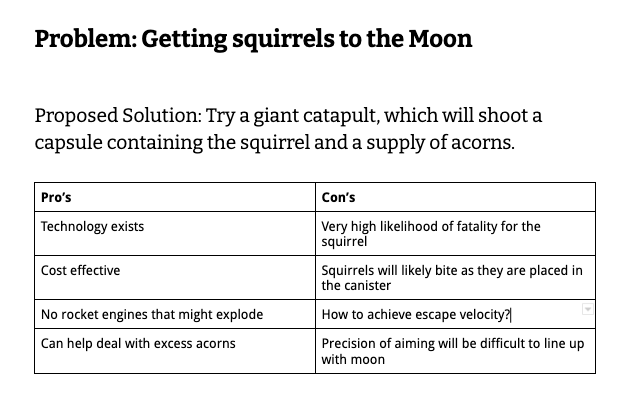

I've found a tool that has helped lead technical problem-solving discussions. It's a tool that keeps the conversation on track, and avoids long drawn out re-hashing of the same solutions and objections.

**The humble Pro's / Con's list.**

| Pro's | Con's |
| -------------- | -------------- |
| Something good    |  Something bad   |

## The problem

I work with a lot of smart people. They bring a lot of perspectives and experience levels to the table when we discuss technical problems.

When we have large meetings I have noticed that some conversations tend to chase their own tail, given enough time. That's because while debating the merits of solutions to issues, those same smart people think of lots of objections to a given proposal.

One might even say engineers _like_ to poke holes in ideas.

## Every solution has a con

Given even a moderately complicated problem, _every_ solution will have some kind of con. The severity of the con is in the eye of the beholder. Ever try raising the con of too many http requests to an executive?

If you're talking to a group of smart people, those people will put an inordinate amount of severity on the con that _they_ present. When leading a discussion, how can you capture those con's and consider them rationally?

## Enter: the Pro’s / Con’s list

During technical meetings like this - think project planning meetings, troubleshooting meetings etc - I like to have a written document in front of everyone that I update in real time. I use a [Google Doc](https://www.google.com/docs/about/), but you can use whatever tool you want. That could be Microsoft Word, Notion, etc. Heck, you could even use another one of my favorite tools - [a spreadsheet](/spreadsheets-as-a-development-tool/).

If using a Doc, I add a table that is 2 columns wide, and start with maybe 5 rows (Insert > Table > 2x5).

I'll put a header with a proposed solution above it, and as pro's or con's are raised I write them down.

## How does this help?

- It makes sure that every pro and every con is heard, and that people in the discussion _feel heard_. Their concerns are not being overlooked.
- It may prompt others, including yourself, to "play devil's advocate" - even against their own proposed solutions! That's because con's are being captured fairly.
- Conversely, people who raise con's to a proposal may actually start offering pro's as well.
- Most crucially, having this in writing in front of everyone means that you can discuss the con _once_ - and move on. If you come back to a certain solution, you can acknowledge that there are drawbacks and leave it at that.

## Advanced Usage: Adding Benefit / Severity Ratings

If you're dealing with a particularly contentious proposal, I suggest adding two columns to your Pro's / Con's list to have a rating of the benefit of the pro or the severity of the con.

If you are having a lot of disagreement, it is likely that the perceived benefit / severity is different for different people. At this point you can focus in on why the people disagreeing see these differently. Getting to the heart of why someone may consider a con a "5" when others don't may take time, but it will head off future resentment.
## Conclusion

I hope this post gives you another tool for leading productive technical meeting. By using a Pro's / Con's list, you can avoid going over the same ground, and will hopefully have a healthier discussion. You may even be surprised by what people come up with.
